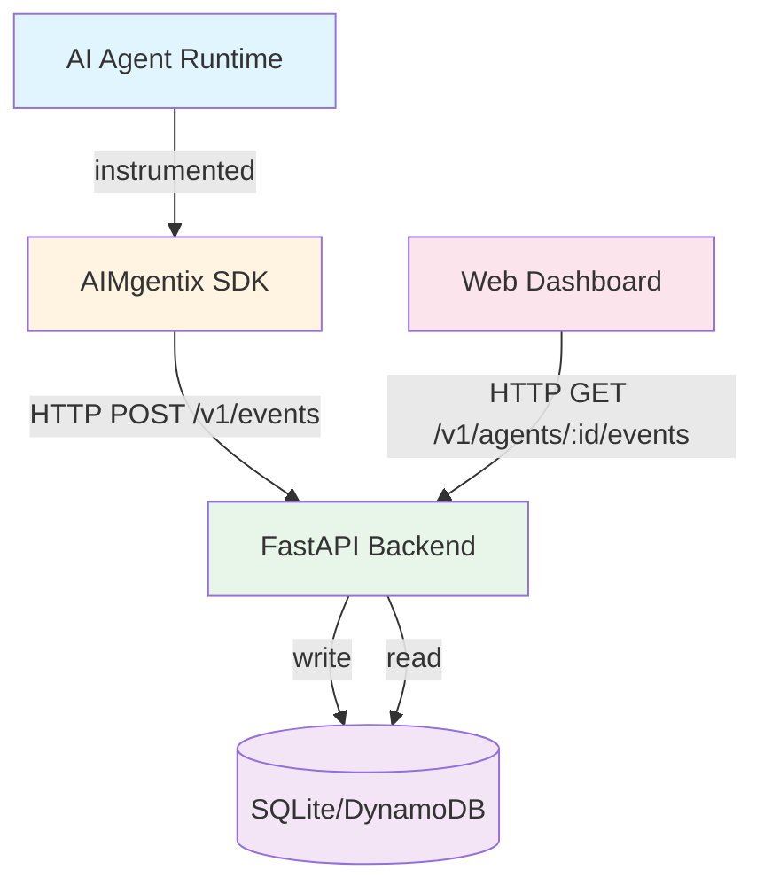
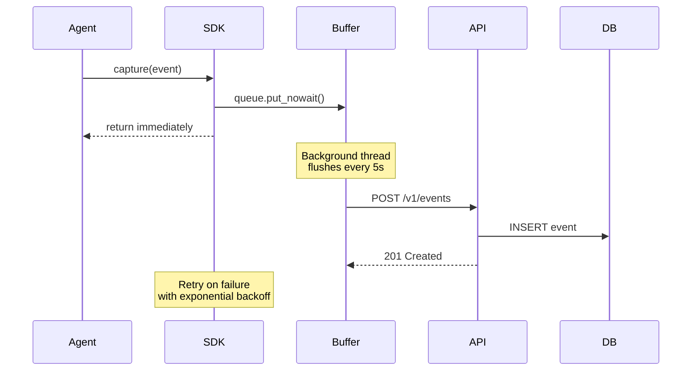

# 🏗️ AIMgentix Architecture

**Last Updated**: 2026-01-25

---

## 🎯 System Overview

AIMgentix is a **lightweight audit layer** for AI agents. It captures agent actions (tool calls, API requests, file access) and provides a complete audit trail for visibility, compliance, and security.

### **Design Principles**

1. **Non-blocking** - Never slow down the agent
2. **Privacy-first** - Redact sensitive data by default
3. **Graceful degradation** - Audit failures don't crash agents
4. **Framework agnostic** - Works with any agent framework
5. **Simple integration** - 3 lines of code to instrument

---

## 📊 High-Level Architecture



---

## 🔄 Event Flow



---

## 🧩 Component Details

### **1. AIMgentix SDK** (`sdk/aimgentix/`)

**Purpose**: Non-blocking event capture with buffering and retry logic

**Key Features**:
- Queue-based buffering (100 events max)
- Background flush thread (every 5 seconds)
- Exponential backoff retry (3 attempts: 1s, 2s, 4s)
- Context manager support

**Files**:
- `client.py` - AuditClient with buffering logic
- `events.py` - Event data classes and enums
- `__init__.py` - Package exports

**Event Schema**:
```python
{
  "event_id": "uuid",
  "timestamp": "iso8601",
  "agent_instance_id": "string",
  "trace_id": "string",
  "actor": "agent | human | system",
  "action_type": "tool_call | http_request | db_query | file_read | file_write | api_call",
  "resource": "string",
  "status": "success | error | pending",
  "latency_ms": int,
  "metadata": {...}
}
```

---

### **2. FastAPI Backend** (`backend/app/`)

**Purpose**: Event ingestion and retrieval API

**Endpoints**:
- `POST /v1/events` - Capture audit event (returns 201)
- `GET /v1/agents/{agent_id}/events` - Retrieve events (reverse chronological, limit 100)
- `GET /` - Health check

**Files**:
- `main.py` - FastAPI app and routes
- `models.py` - Pydantic request/response models
- `db.py` - SQLAlchemy database setup

**Database Schema** (SQLite):
```sql
CREATE TABLE audit_events (
    id INTEGER PRIMARY KEY,
    event_id TEXT UNIQUE NOT NULL,
    timestamp TEXT NOT NULL,
    agent_instance_id TEXT NOT NULL,
    trace_id TEXT,
    actor TEXT NOT NULL,
    action_type TEXT NOT NULL,
    resource TEXT NOT NULL,
    status TEXT NOT NULL,
    latency_ms INTEGER,
    metadata TEXT
);

CREATE INDEX idx_agent_instance ON audit_events(agent_instance_id);
CREATE INDEX idx_trace ON audit_events(trace_id);
CREATE INDEX idx_timestamp ON audit_events(timestamp);
```

---

### **3. Web Dashboard** (`demo/ui/index.html`)

**Purpose**: Real-time audit trail visualization

**Features**:
- Event timeline with color-coded status badges
- Auto-refresh (every 5 seconds)
- Filter by agent instance ID
- Responsive design

**Tech Stack**: Vanilla HTML/CSS/JavaScript (no frameworks)

---

## 🔐 Security & Privacy

### **Privacy-First Design**

1. **Metadata Redaction** - Sensitive data redacted by default
2. **No PII Storage** - Agent IDs are opaque identifiers
3. **Local-First** - SQLite database stays on your infrastructure
4. **No External Calls** - SDK only talks to your backend

### **Future Security Features** (Post-MVP)

- [ ] API authentication (JWT tokens)
- [ ] TLS/HTTPS enforcement
- [ ] Rate limiting
- [ ] Audit log encryption at rest
- [ ] RBAC for dashboard access

---

## 📈 Scalability

### **Current (MVP)**
- SQLite database
- Single FastAPI instance
- ~1000 events/second
- Good for: Demos, pilots, small deployments

### **Production (Future)**
- DynamoDB or PostgreSQL
- Horizontal scaling with load balancer
- Event streaming (Kafka/Kinesis)
- ~100k+ events/second
- Good for: Enterprise deployments

---

## 🔌 Integration Patterns

### **LangChain Agents**
```python
from aimgentix import AuditClient, AuditEvent, ActorType, ActionType, EventStatus

audit_client = AuditClient()

# Wrap tool execution
def instrumented_tool(tool_name, *args, **kwargs):
    start = time.time()
    try:
        result = original_tool(*args, **kwargs)
        audit_client.capture(AuditEvent(
            agent_instance_id="agent-001",
            trace_id="trace-123",
            actor=ActorType.AGENT,
            action_type=ActionType.TOOL_CALL,
            resource=tool_name,
            status=EventStatus.SUCCESS,
            latency_ms=int((time.time() - start) * 1000)
        ))
        return result
    except Exception as e:
        audit_client.capture(AuditEvent(..., status=EventStatus.ERROR))
        raise
```

---

## 🚀 Deployment Options

See [OPERATIONS.md](OPERATIONS.md) for detailed deployment instructions.

**Quick Options**:
1. **Local** - `./run_demo.sh`
2. **Docker** - `docker-compose up`
3. **Cloud** - Deploy to AWS/GCP/Azure
4. **Codespaces** - One-click GitHub Codespaces

---

## 📚 Related Documentation

- [QUICKSTART.md](QUICKSTART.md) - Getting started guide
- [OPERATIONS.md](OPERATIONS.md) - Production deployment
- [README.md](../README.md) - Project overview
- [mvp-master-plan.md](../mvp-master-plan.md) - Full product roadmap

